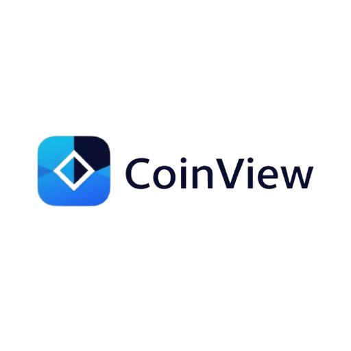
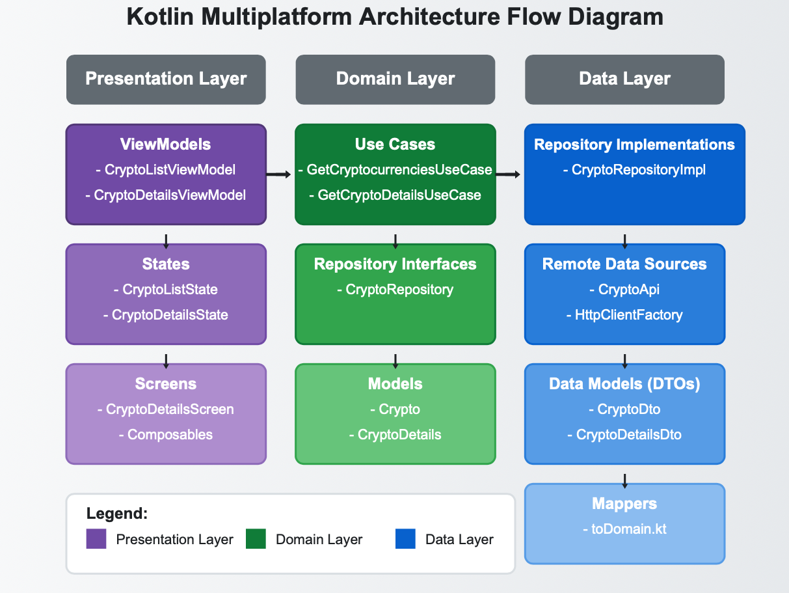

# CoinView KMP - Cryptocurrency Tracker

<div align="center">
  
</div>

A modern cryptocurrency tracking application built with Kotlin Multiplatform (KMP) that runs on Android, iOS, and Web platforms. The app provides real-time cryptocurrency market data, price tracking, and detailed coin information.

## Demo

### Android
<div align="center">
  
</div>

### iOS
<div align="center">
  
</div>

## Features

- 📊 Real-time cryptocurrency market data
- 🔍 Search functionality for cryptocurrencies
- 📈 Detailed price history charts
- 💰 Market statistics and trends
- 🌐 Cross-platform support (Android, iOS, Web)
- 🎨 Modern UI with Compose Multiplatform

## Project Structure

```
├── composeApp/              # Shared code across platforms
│   ├── src/
│   │   ├── commonMain/      # Shared Kotlin code
│   │   ├── androidMain/     # Android-specific code
│   │   ├── iosMain/         # iOS-specific code
│   │   └── wasmJsMain/      # Web-specific code
├── iosApp/                  # iOS application entry point
└── androidApp/              # Android application entry point
```

## Technologies Used

- Kotlin Multiplatform (KMP)
- Compose Multiplatform for UI
- Ktor for networking
- Kotlin Serialization
- Kotlin Coroutines
- Koin for dependency injection

## Architecture

<div align="center">
  
</div>

The app follows Clean Architecture and MVVM (Model-View-ViewModel) patterns, ensuring a robust, maintainable, and testable codebase:

### Clean Architecture Layers

1. **Data Layer**
   - Remote data sources (API calls)
   - Repository implementations
   - Data mappers (DTO to Domain)
   - Local data sources (if needed)

2. **Domain Layer**
   - Business logic and use cases
   - Repository interfaces
   - Domain models
   - Business rules and validations

3. **Presentation Layer**
   - ViewModels
   - UI State management
   - Screen composables
   - Navigation

### Key Architectural Features

- 🧩 Clear separation of concerns
- 🔄 Unidirectional data flow
- 🧪 Highly testable components
- 🔒 Dependency injection for loose coupling
- 📱 Platform-agnostic business logic
- 🚀 Scalable and maintainable structure

## Setup

1. Clone the repository
2. Open the project in Android Studio or IntelliJ IDEA
3. For iOS development:
   - Open the `iosApp` folder in Xcode
   - Select your target device/simulator
   - Build and run the app
4. For Android development:
   - Open the project in Android Studio
   - Select your target device/emulator
   - Build and run the app
5. For Web development:
   - Run the `:composeApp:wasmJsBrowserDevelopmentRun` Gradle task

## API Key Setup

1. Get your API key from [CoinCap API](https://docs.coincap.io/)
2. Create a `secrets.properties` file in the root directory
3. Add your CoinCap API key:
   ```
   COINCAP_API_KEY=your_api_key_here
   ```

## Version

### Current Version
- **Android**: 1.0.0
- **iOS**: 1.0.0

### Version History

#### v1.0.0 (Initial Release)
- Initial release with basic cryptocurrency tracking features
- Support for multiple cryptocurrencies
- Real-time price updates
- Portfolio tracking
- Cross-platform compatibility (Android & iOS)

### Upcoming Features (v1.1.0)
- [ ] Dark mode support
- [ ] Additional cryptocurrency details
- [ ] Price alerts
- [ ] Enhanced portfolio analytics

## Contributing

We welcome contributions to CoinView KMP! Here's how you can help:

### Getting Started

1. Fork the repository
2. Clone your fork:
   ```bash
   git clone https://github.com/YOUR_USERNAME/coin_view_kmp.git
   ```
3. Create a new branch for your feature:
   ```bash
   git checkout -b feature/your-feature-name
   ```

### Development Guidelines

- Follow the existing code style and architecture patterns
- Write clear commit messages
- Add tests for new features
- Update documentation when necessary
- Keep pull requests focused on a single feature or bug fix

### Pull Request Process

1. Update the README.md with details of changes if needed
2. Update the documentation
3. The PR will be merged once you have the sign-off of at least one maintainer

### Code of Conduct

- Be respectful and inclusive
- Be patient and welcoming
- Be open to constructive feedback
- Focus on what's best for the community

### Need Help?

- Open an issue for bugs or feature requests
- Join our community discussions
- Reach out to maintainers for guidance

## License

This project is licensed under the MIT License - see the LICENSE file for details.